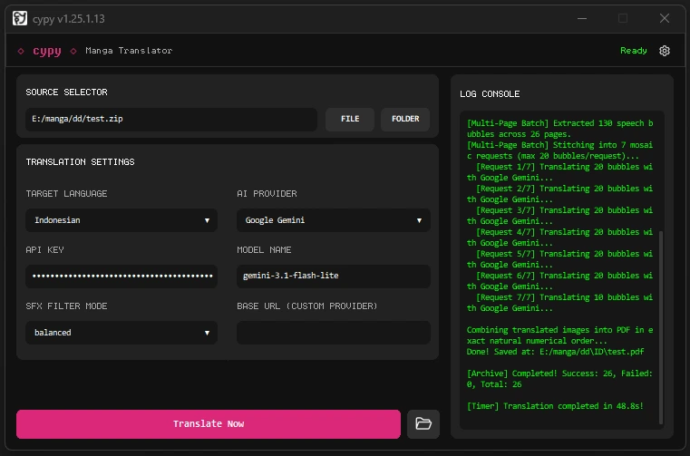

# cypy

<p align="center">
  
</p>

<p align="center">
  
</p>

**cypy** is an automated manga translation tool. It detects speech bubbles using YOLOv8, translates text via LLM APIs (Gemini, OpenAI, Zen, OpenRouter), cleans background areas, and fits translated typography into comic panels.

---

## Features

- **Multi-Format Support:** Process images (PNG, JPG, WEBP), PDFs, and archives (ZIP, CBZ, RAR, CBR) in exact page sequence.
- **Drag & Drop:** Drop files or folders directly onto the GUI or terminal window.
- **Smart Batching & Rate Limiting:** Automatic bubble chunking (max 20 per request), request throttling, and retry handling for vision LLM APIs.
- **Multiple AI Providers:** Google Gemini, OpenAI, Zen (free), OpenCode Go, OpenRouter, and custom OpenAI-compatible endpoints.
- **GUI & CLI Modes:** Desktop graphical interface or interactive terminal prompt.

---

## Translation Preview

| Original Page (Before) | Translated Page (After) |
| :---: | :---: |
|  |  |

---

## Quick Start

### Prerequisites
- **Python:** 3.8 to 3.11 (Python 3.10 recommended).

### Installation

```bash
git clone https://github.com/indravoyager/cypy.git
cd cypy

python -m venv venv

# Windows
venv\Scripts\activate
# Linux / macOS
source venv/bin/activate

pip install -e .
```

### Usage

```bash
# GUI Mode (Default)
cypy

# CLI Mode
cypy --cli
```

---

## CLI Commands

When running in **CLI Mode**, type commands directly into the prompt:

| Command | Description |
| :--- | :--- |
| `lang` / `switch` | Change target language. |
| `provider` / `api` | Switch LLM provider. |
| `model` | Change active model name. |
| `status` | Display current configuration. |
| `tweak` | Open layout padding and filter adjustment menu. |
| `help` | Show command list. |
| `stop` / `exit` | Exit application. |

---

## Standalone Executable (.exe)

To build a standalone Windows executable:

```bash
python build.py
```

---

## License

[MIT](LICENSE)
